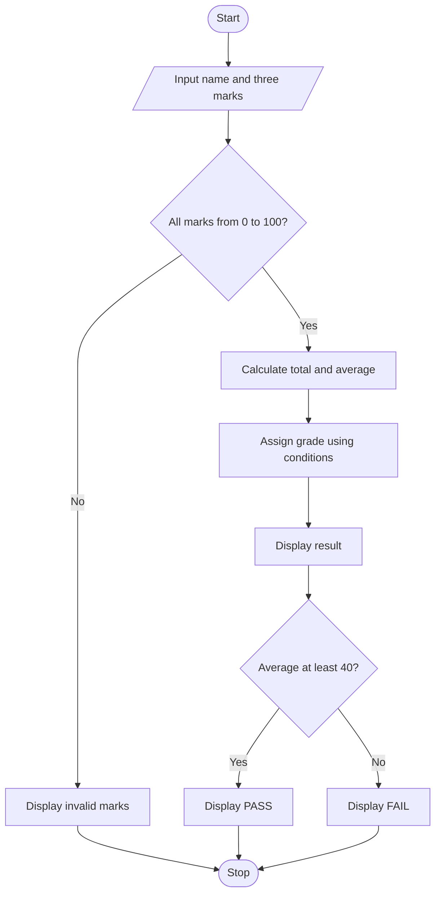

# Flowchart

```mermaid
flowchart TD
    A([Start]) --> B[/Input name and three marks/]
    B --> C{All marks from 0 to 100?}
    C -- No --> D[Display invalid marks]
    D --> H([Stop])
    C -- Yes --> E[Calculate total and average]
    E --> F[Assign grade using conditions]
    F --> G[Display result]
    G --> I{Average at least 40?}
    I -- Yes --> J[Display PASS]
    I -- No --> K[Display FAIL]
    J --> H
    K --> H
```
